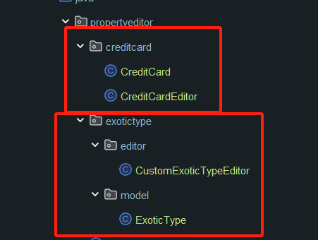

## 使用 PropertyEditorSupport 绑定 @PathVariable 参数

 **注意:** 在不同的包中需要使用 #InitBinder 注册
```
@InitBinder
public void initBinder(WebDataBinder binder) {
    binder.registerCustomEditor(ExoticType.class, new CustomExoticTypeEditor());
}
```
访问
> /property-editor/exotic-type/passion-fruit 

> /property-editor/credit-card/1234-1234-1111-0019