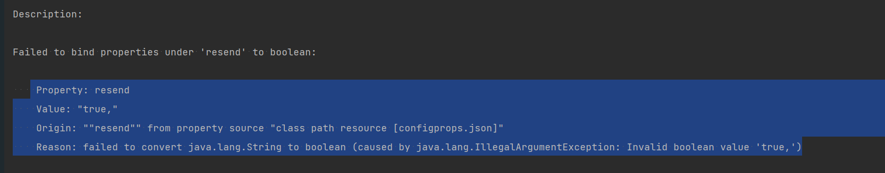

## 通过命令行加载属性

设置环境变量 SPRING_APPLICATION_JSON='{"environment":{"name":"production"}}' java -jar app.jar

```
java -Dspring.application.json='{"environment":{"name":"production"}}' -jar app.jar
```
```
java -jar app.jar --spring.application.json='{"environment":{"name":"production"}}'
```

## 通过 PropertySource 注解加载属性
外部文件中提供标准 JSON 格式的数据（我们将其命名为 configprops.json）
```
{
  "host" : "mailer@mail.com",
  "port" : 9090,
  "resend" : true
}
```
将 JSON 文件连接到配置类
``` 
@Component
@PropertySource(value = "classpath:configprops.json")
@ConfigurationProperties
public class JsonProperties {
    // same code as before
}
```


```
 Property: resend
    Value: "true,"
    Origin: ""resend"" from property source "class path resource [configprops.json]"
    Reason: failed to convert java.lang.String to boolean (caused by java.lang.IllegalArgumentException: Invalid boolean value 'true,')
```
需要实现 PropertySourceFactory 解析 JSON
``` 
public class JsonPropertySourceFactory 
  implements PropertySourceFactory {
    @Override
    public PropertySource<?> createPropertySource(
      String name, EncodedResource resource)
          throws IOException {
        Map readValue = new ObjectMapper()
          .readValue(resource.getInputStream(), Map.class);
        return new MapPropertySource("json-property", readValue);
    }
}
```

## 将属性加载到自定义命名空间中
从 JSON 文件加载数据，解析后，我们将使用 MapPropertySources 填充 Spring 环境