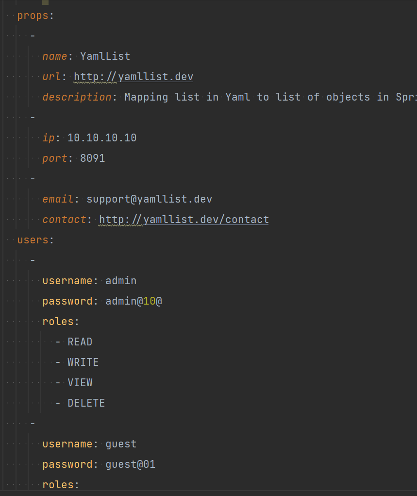

YAML 文件不支持 @PropertySource 注解

## 默认情况下，@PropertySource 不会加载 YAML 文件

需要自定义 PropertySourceFactory

@PropertySource 带有 factory 属性。我们可以利用它来提供 PropertySourceFactory 的自定义实现，它将处理 YAML 文件处理
[YamlPropertySourceFactory.java](src%2Fmain%2Fjava%2Fyaml2%2Ffactory%2FYamlPropertySourceFactory.java)
``` 
public class YamlPropertySourceFactory implements PropertySourceFactory {

    @Override
    public PropertySource<?> createPropertySource(String name, EncodedResource encodedResource) 
      throws IOException {
        YamlPropertiesFactoryBean factory = new YamlPropertiesFactoryBean();
        factory.setResources(encodedResource.getResource());

        Properties properties = factory.getObject();

        return new PropertiesPropertySource(encodedResource.getResource().getFilename(), properties);
    }
}
```
## 从 Spring 属性文件注入数组和列表 [lists](src%2Ftest%2Fjava%2Flists)
1.默认
``` 
arrayOfStrings=Baeldung,dot,com
```
2.注入列表
``` 
@Value("${arrayOfStrings}")
private List<String> unexpectedListOfStrings;
```
3.使用自定义分隔符
``` 
listOfStringsWithCustomDelimiter=Baeldung;dot;com
```
4.注射其他类型
``` 
listOfBooleans=false,false,true
listOfIntegers=1,2,3,4
listOfCharacters=a,b,c
```
5.以编程方式读取属性
```
@Autowired
private Environment environment;
```
使用 getProperty 方法通过指定其键和预期类型来读取任何属性
```
@Test
void whenReadingFromSpringEnvironment_thenPropertiesHaveExpectedValues() {
    String[] arrayOfStrings = environment.getProperty("arrayOfStrings", String[].class);
    List<String> listOfStrings = (List<String>)environment.getProperty("arrayOfStrings", List.class);

    assertArrayEquals(new String[] {"Baeldung", "dot", "com"}, arrayOfStrings);
    assertEquals(Arrays.asList("Baeldung", "dot", "com"), listOfStrings);
}
```

## 注入Map
[yamlmap](src%2Fmain%2Fjava%2Fyamlmap)

> @ConfigurationProperties与@Value
> @Value 允许我们通过其键直接注入特定的属性值。 但是，@ConfigurationProperties批注将多个属性绑定到特定对象，并通过映射的对象提供对属性的访问

## 注入对象
